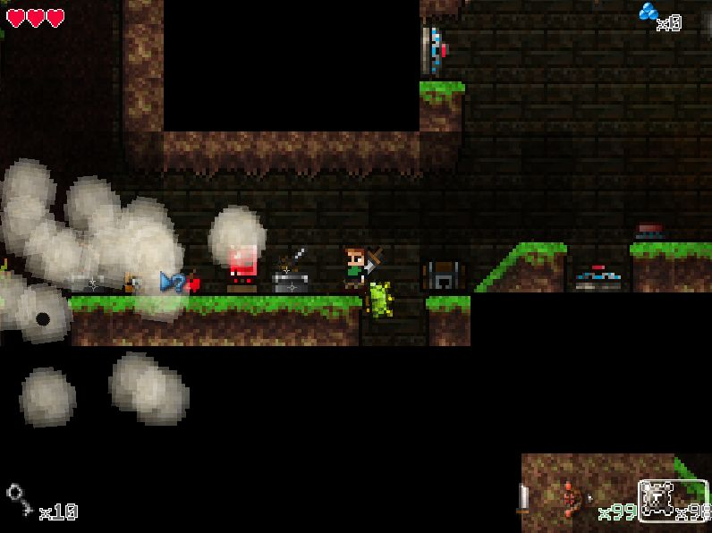

# Legend Of Kevin
A platform videogame prototype with wall climbing mechanic and tools.

## Build
* Linux: 
  1. Install the dotnet runtime v7.0 and the MGCB
  
    * sudo apt install dotnet-sdk-7.0
      
    * cd legend-of-kevin
    
  2. Install & Run MGCB
    dotnet tool install -g dotnet-mgcb
    cd ./data/game-content
    dotnet mgcb --outputDir=../../bin/Debug/net7.0/game-content --intermediateDir=../../obj/mgcb-temp ./game-content.mgcb  

## Controls
Use the arrow keys to move the character and click things with the mouse.

Right mouse button uses teh equipped weapon.

Use the mouse wheel to srcoll between different weapons.
